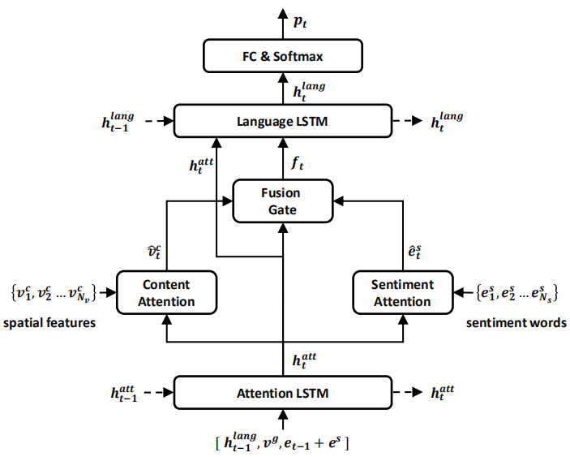
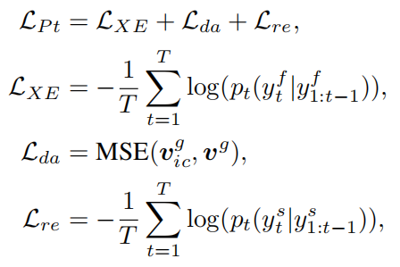
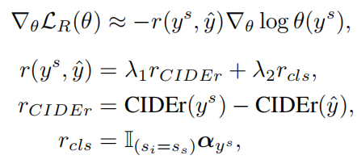

# InSentiCap_model
A pytorch implementation of our paper [Image Captioning with Inherent Sentiment (ICME 2021 Oral)](./method_figs/Image%20Captioning%20with%20Inherent%20Sentiment.pdf).

### Citation
```
@inproceedings{li2021image,
  title={Image Captioning with Inherent Sentiment},
  author={Li, Tong and Hu, Yunhui and Wu, Xinxiao},
  booktitle={2021 IEEE International Conference on Multimedia and Expo (ICME)},
  year={2021},
  organization={IEEE}
}
```

## Environment
 - Python 3.7
 - Pytorch 1.3.1

## Method
### 1. Architecture


### 2. Train Strategy
 - Pre-training stage  

 - Fine-tuning stage  


## Result
### Evaluation metrics

|Sentiment|Bleu-1|Bleu-3|METEOR|CIDEr|ppl(↓)|cls(%)|
|:---:|:---:|:---:|:---:|:---:|:---:|:---:|
|positive|59.7|25.3|20.9|61.3|13.0|98.5|
|negative|59.1|24.3|19.4|53.3|12.3|95.5|
|neutral|73.5|41.2|24.7|97.5|8.4|98.9|

